# 7 Exploring and reporting

> 1. Move the clusters around to make it easier or harder for the classifier to find a decent boundary. Pay attention to when the `minimize` function prints an error message that it can not find a solution.
> 2. Implement some of the non-linear kernels. you should be able to classify very hard datasets.
> 3. The non-linear kernels have parameters; explore how they influence the decision boundary. Reason about this in terms of the bias-variance trade-off.
> 4. Explore the role of the slack parameter C. What happens for very large/small values?
> 5. Imagine that you are given data that is not easily separable. When should you opt for more slack rather than going for a more complex model (kernel) and vice versa?

### 1. 

Using the provided datasets, a linear kernel provided a very tight-fitting separator. By adjusting the datasets as depicted in the second image below, renders a linear kernel non-functional. Instead a polynomial or radial kernel might be needed.

| Linear kernel with provided datasets | Linear kernel with nonlinear dataset |
| ------------------------------------ | ------------------------------------ |
| 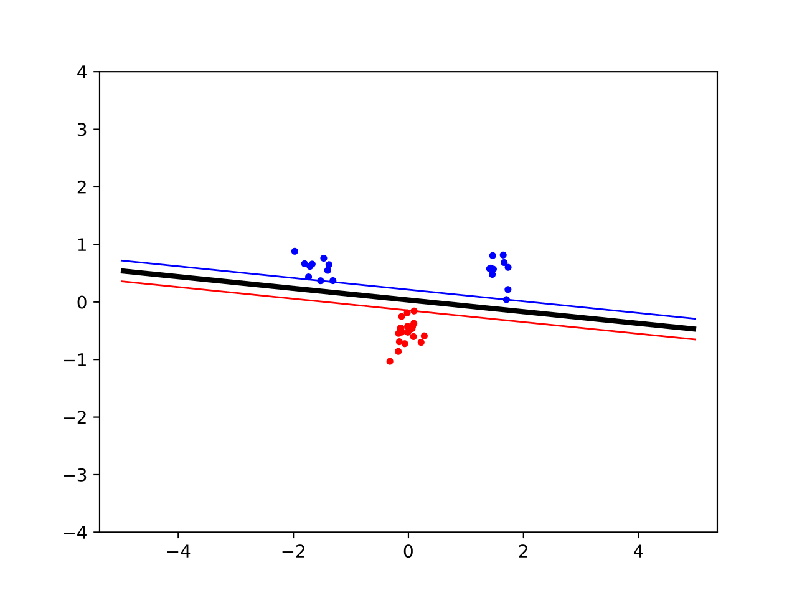 | 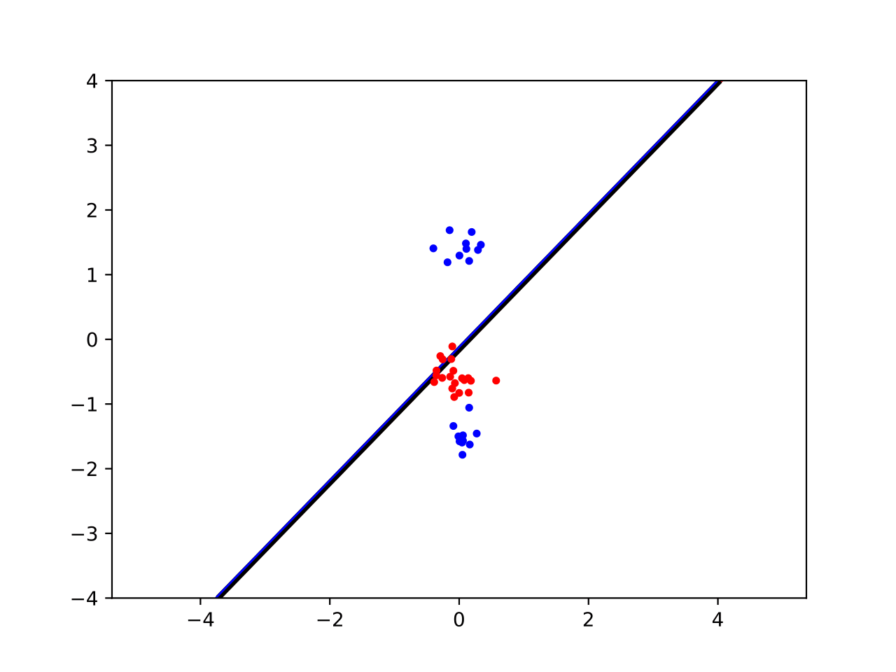 |

### 2. 

Implementing the polynomial and radial kernel, the dataset that a linear kernel could not separate now became separable. 

The following plots without slack variables. 

| Polynomial kernel with provided datasets (p=2) | Polynomial kernel with provided datasets (p=3) |
| ------------------------------------ | ------------------------------------ |
| 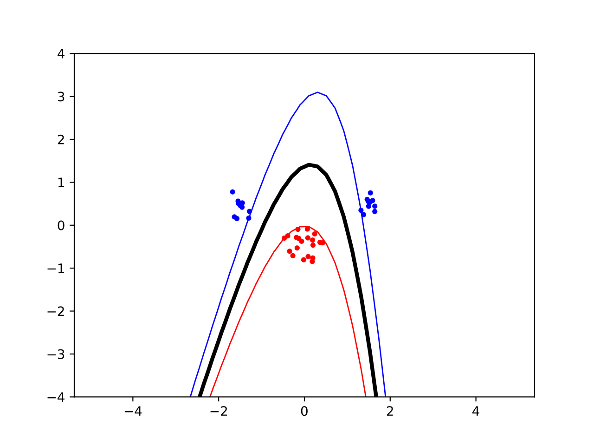 | 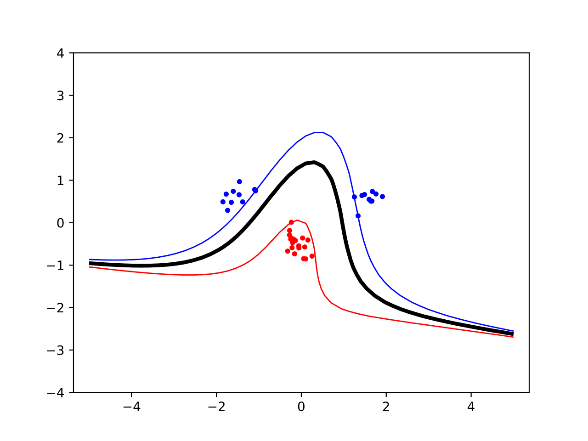 |  

| Polynomial kernel with provided datasets (p=4) | Polynomial kernel with provided datasets (p=5) |
| ------------------------------------ | ------------------------------------ |
| 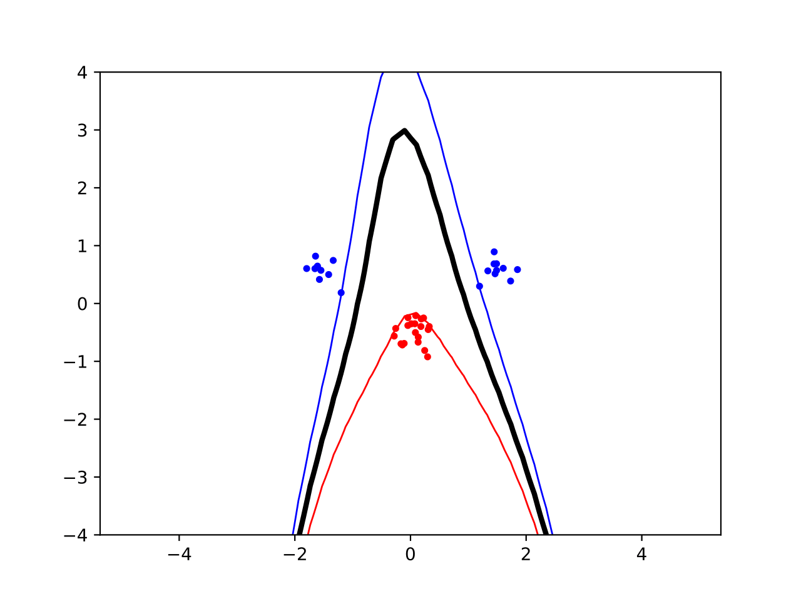 | 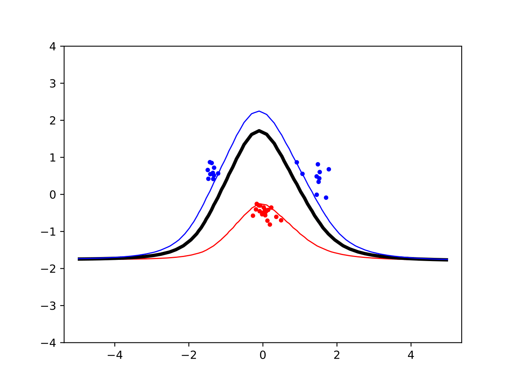 |  

| Radial kernel with provided datasets (sigma=1) | Radial kernel with provided datasets (sigma=2) |
| ------------------------------------ | ------------------------------------ |
| 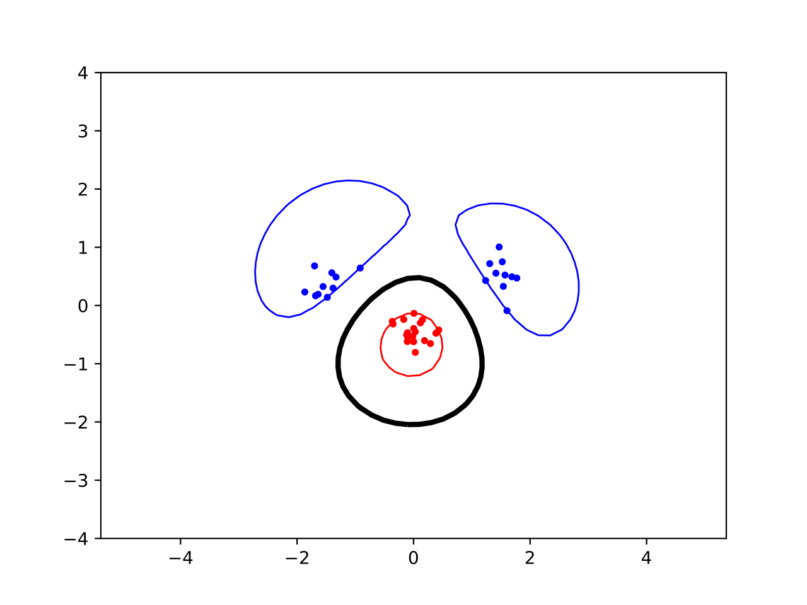 | 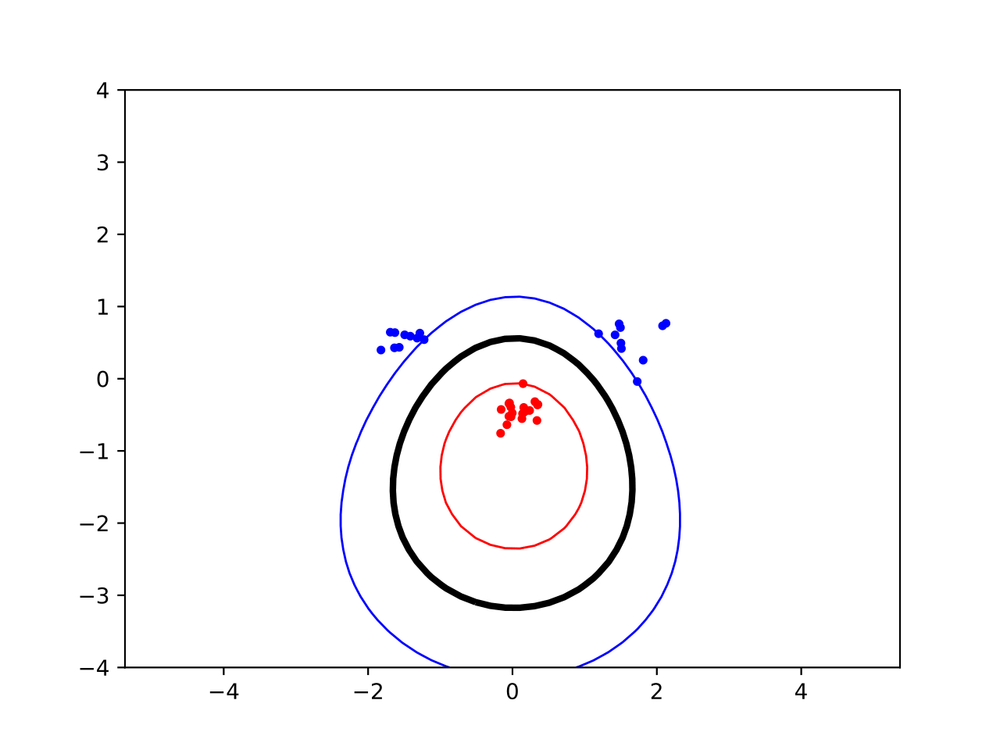 |  

| Radial kernel with provided datasets (sigma=3) |  |
| ------------------------------------ | ------------------------------------ |
| 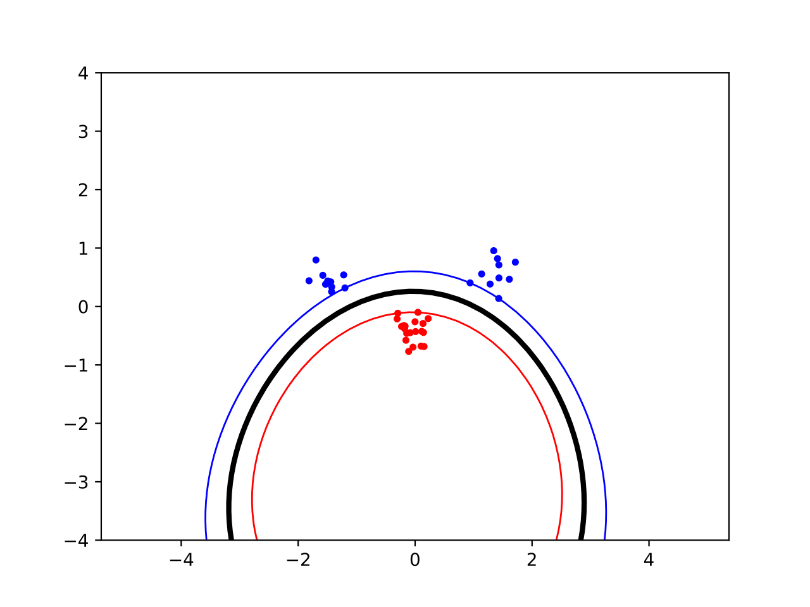 |  | 

#### Succcessful classification of nonlinearly separable dataset with polynomial and radial kernels 

| Polynomial kernel with nonlinear datasets (p=2) | Radial kernel with nonlinear datasets (sigma=2) |
| ------------------------------------ | ------------------------------------ |
| 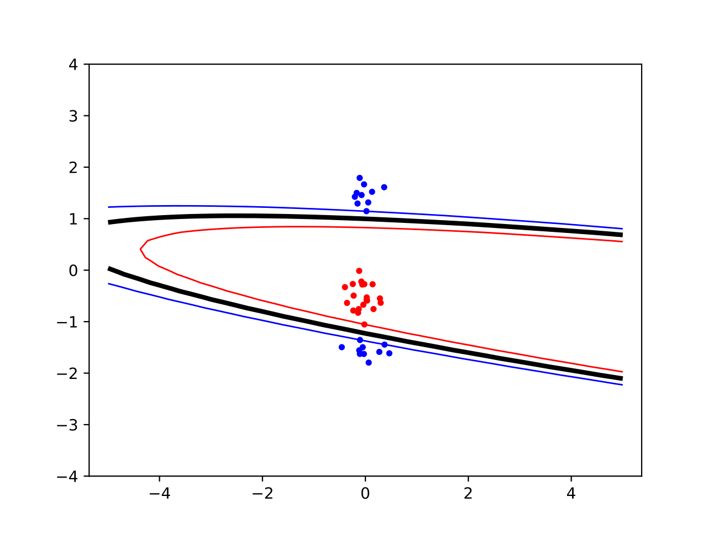 | 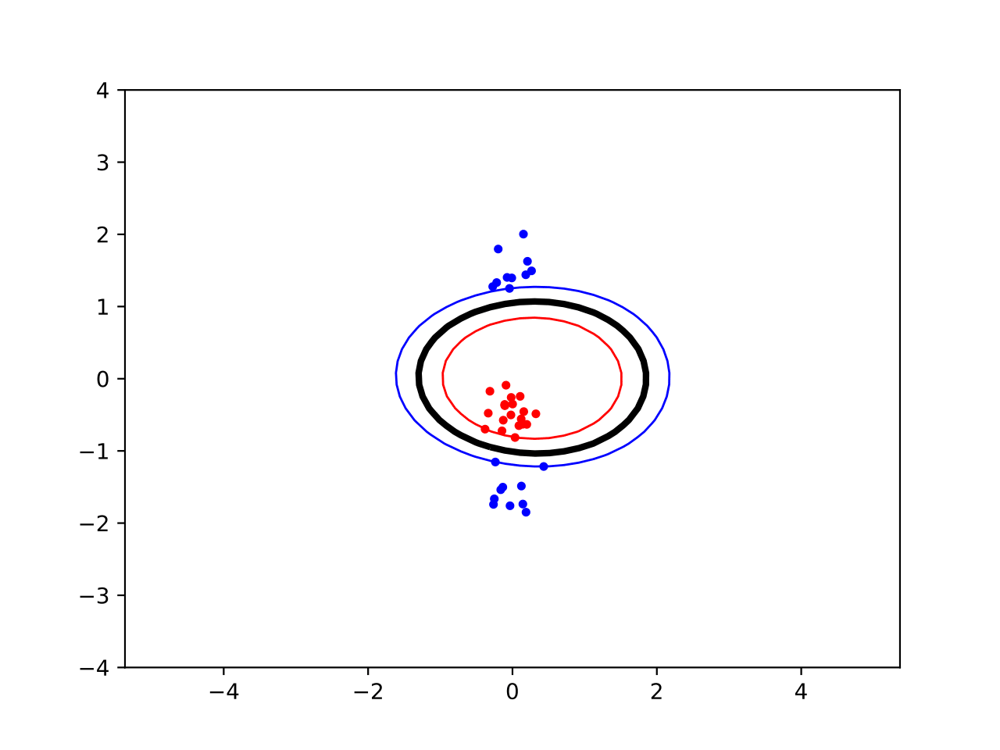 |  

### 3. 

By increasing the degree of the polynomial in the polynomial kernel, we increase the bias of the model, ie we overfit the model to the training dataset. In the polynomial kernel the parameter p changes the degree of the polynomial while sigma in the radial kernel define the smoothness of the curve. 

By varying some of these parameters whe can make the model fit more closely or more loosely the dataset. If we increase the sigma of the radial kernel, for example, we obtain a smoother curve and increase the bias of the model while decreasing the variance. On the other hand if we decrease sigma we obtain a classification that tends to be more "edgy" and overfit the data (hence increase variance).

### 4. 

The slack parameter C in an SVM controls the trade-off between maximizing the margin and minimizing classification errors. It allows for soft-margin SVM, meaning that some points can be misclassified if it helps improve generalization.

If C is very large:

The optimizer strongly penalizes misclassified points.
The model prioritizes correct classification over a large margin.
The decision boundary may become tightly fitted to the data, which can lead to overfitting (poor generalization to new data).

If C is very small 

The optimizer allows more misclassifications.
The model prioritizes a larger margin over correctly classifying all points.
The decision boundary becomes smoother and more generalized, but may misclassify some training points.

### 5. 

Tradeoff: maximize margin / minimize error. Increase value of C parameter: weight of missclassified points increase => margin gets smaller.   

A more complex kernel might overfit the training data, while the increased slack tolerance will likely provide better generilization. To this end, a more complex kernel will decrease bias and increase variance, while underfitting with a simpler model and higher slack might underfit the training set and yield high bias and low variance. 

Use higher slack (C) when data is mostly linear with some noise or outliers to avoid overfitting. Use a more complex kernel when data is clearly non-linearly separable and a linear model fails, especially with a large dataset
